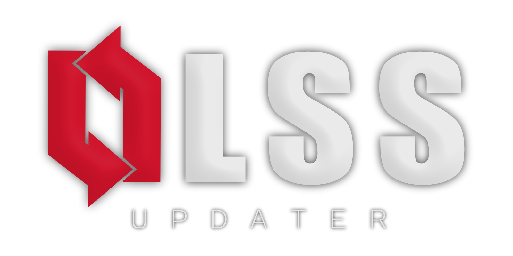
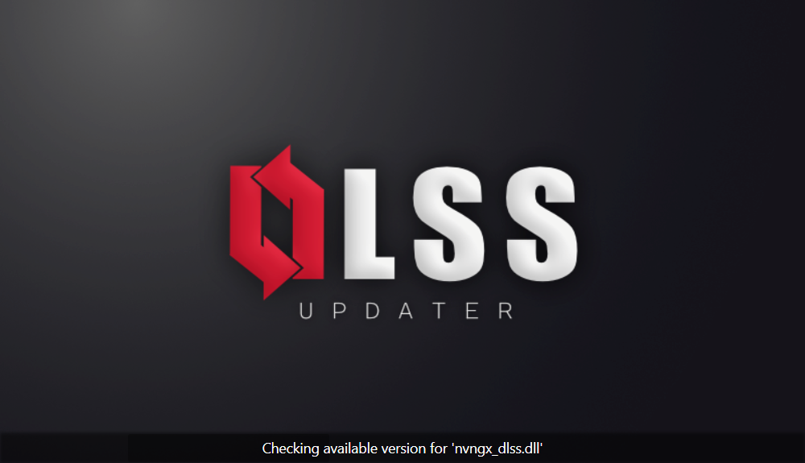
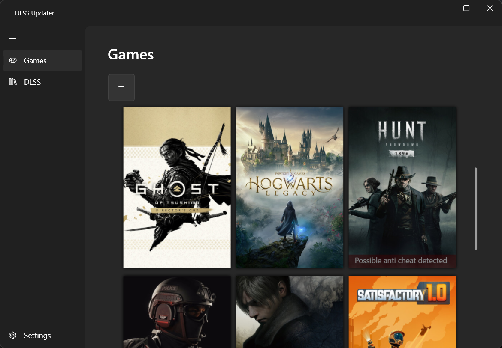
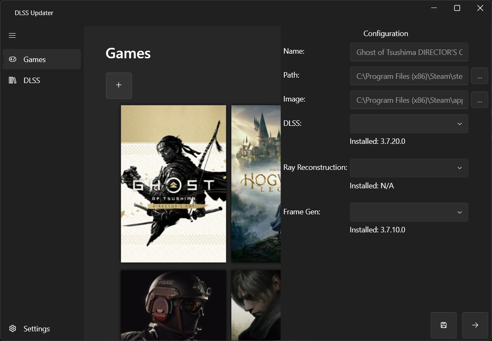
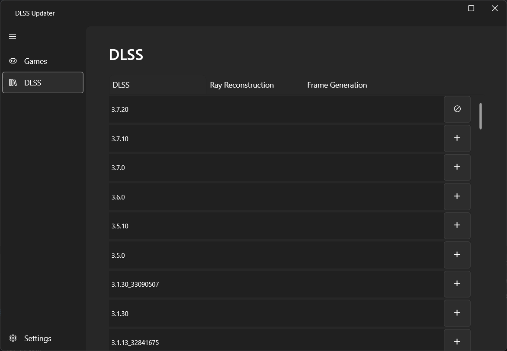
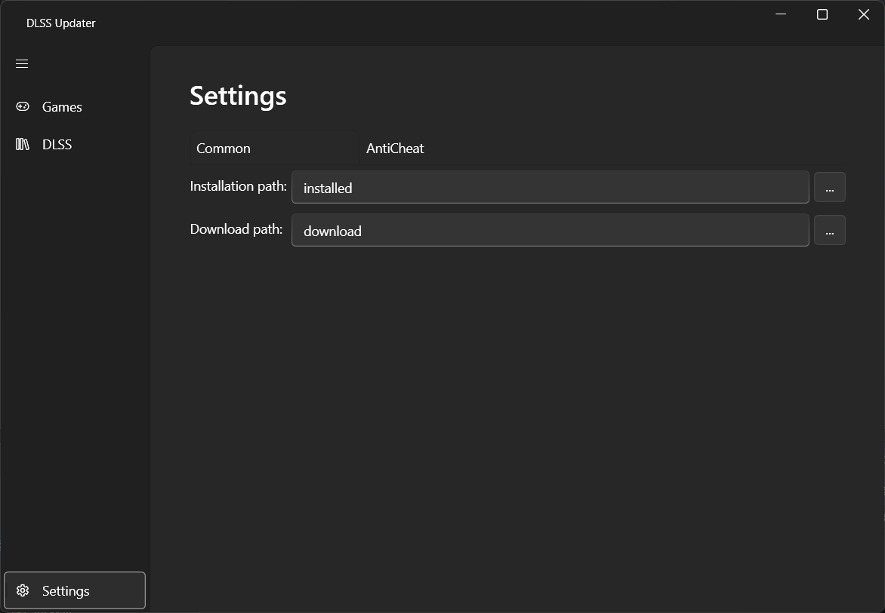
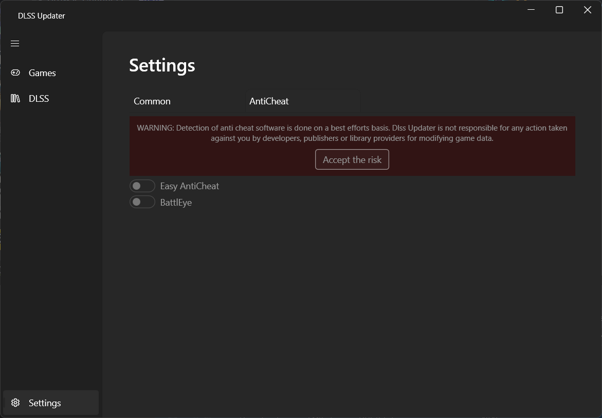
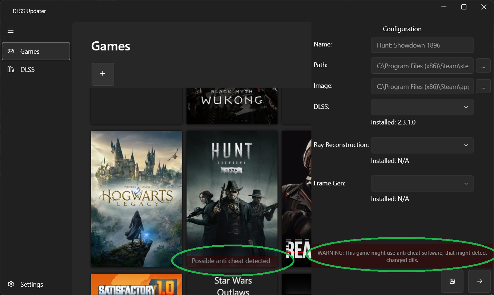

# Introduction

Dlss Updater is an open source software written to make updating any of the DLSS dlls available from nVidia easier for the end user. It allows you to update either the base DLSS dll, the ray reconstruction dll as well as the frame generation dll. This can be used to improve the visuals of games that may use an older version of DLSS and have not been updated to the latest version.
It also allows the user to easily switch back to an older version if desired. It uses TechPowerUp as a source for all available dlls, from which the user could also download the files separately. With Dlss Updater this task is unified in a specific application designed for such a task.

# Build requirements
To build Dlss Updater on your machine, you first need to check out the git repository (or download a zip archive). Dlss Updater was developed using **Visual Studio 2022** and uses the **WPF** ui framework.  In addition, several third-party nuget extensions are used to improve aspects of the software.
At the time of writing, these nugets include:
* [WPF UI](https://github.com/lepoco/wpfui)
* [WpfBindingErrors](https://github.com/bblanchon/WpfBindingErrors)
* [MdXaml](https://github.com/whistyun/MdXaml)

With this you should be able to compile Dlss Updater.

# Usage
## Prerequisites
Make sure you have the latest .NET Framework installed to run Dlss Updater. To reduce the size of the archive, the runtime is _NOT_ bundled with the application. Dlss Updater uses .NET 8.

## First start
When you start the software, you will be greeted by a splash screen where Dlss Updater is getting everything ready. It will load saved settings and also request all available versions for the different DLSS libraries. Note that Dlss Updater has implemented a caching system to reduce server load on successive starts. The caching time is defined in [Settings.cs](Settings.cs) under **Constants.CacheTime**.

## Games page
After that, the main interface of the application will open. Here you can see all the games you have added to Dlss Updater, as well as those that are automatically detected (e.g. Steam).

Here you can select a game by left clicking on it's image. This will open the configuration panel. This will show you all installed DLSS versions of the game and lets you change them to another one by selecting it from one of the combo boxes. If the combo box lists are empty, you need to install a version of the dll first using Dlss Updater in the [DLSS page](#dlss-page). After you have made your selections, click the Save button at the bottom of the Configuration Panel to apply your changes. To close the Configuration Panel, click the right arrow button.

## DLSS page
On this page you will see all available versions of DLSS dlls that you can download. Just click on the **+** button on the right and the specific version will be downloaded. After that it can be used for any game in the [Games Page](#games-page).

## Settings page
The settings page allows you to change the way DLSS Updater works. Under the **Common** tab you can change the directories where files are installed and downloaded. 
You can also change the AntiCheat detection settings on the AntiCheat tab. Please refer to the [AntiCheat detection](#anticheat-detection) section for more information.

# Features

## Auto detection
Dlss Updater features automatic game detection from popular game libraries. Currently the following libraries are supported:
* Steam
* Ubisoft Connect

Other libraries may be added in the future.

## AntiCheat detection
Dlss Updater tries to detect common anti-cheat software in games using several methods. This is by no means perfect and may result in invalid detections or none at all. This feature can be configured in the settings page by selecting the **AntiCheat** tab.

If this is the first time you have opened this tab, you must accept the warning to enable this feature by clicking the **Accept the risk** button. After clicking the button, the feature will be enabled and you can simply click one of the toggle buttons below to enable detection for that particular anti-cheat software.

After that, games in your [Games page](#games-page) will display a red warning if an anti-cheat software has been detected. This warning is displayed directly on the game's image in the list and in the configuration panel.

Dlss Updater will not prevent you from updating any DLSS dll for such games, but keep in mind that doing so may lead to bans. 

# License
Dlss Updater is free and open source software licensed under the MIT License. You can use it in both private and commercial projects. But you must include a copy of the license in your project.

# Discord
If you have further question feel free to join the official discord [here](https://discord.gg/WShdqSDSvu)

# Known issues
* Changes to folders in the [Settings Page](#settings-page) will not take effect until the application is restarted.
* Multiple instances of the the dll in a game folder can lead to strange behaviour. Make sure that there is only 1 instance in a game.